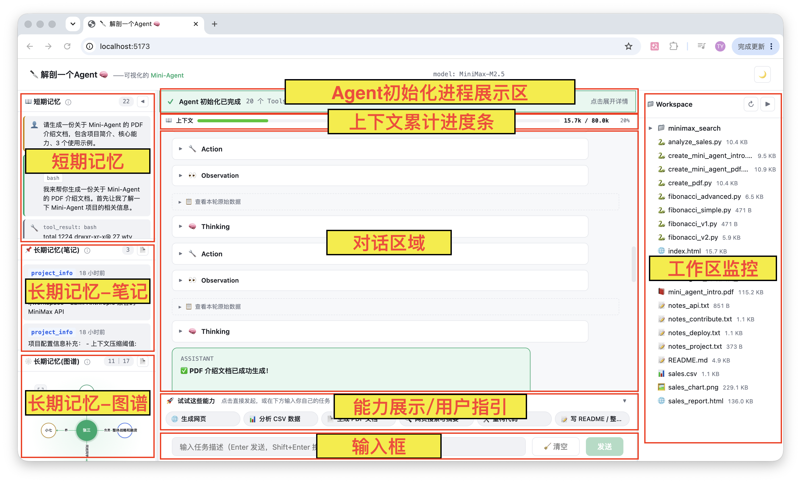
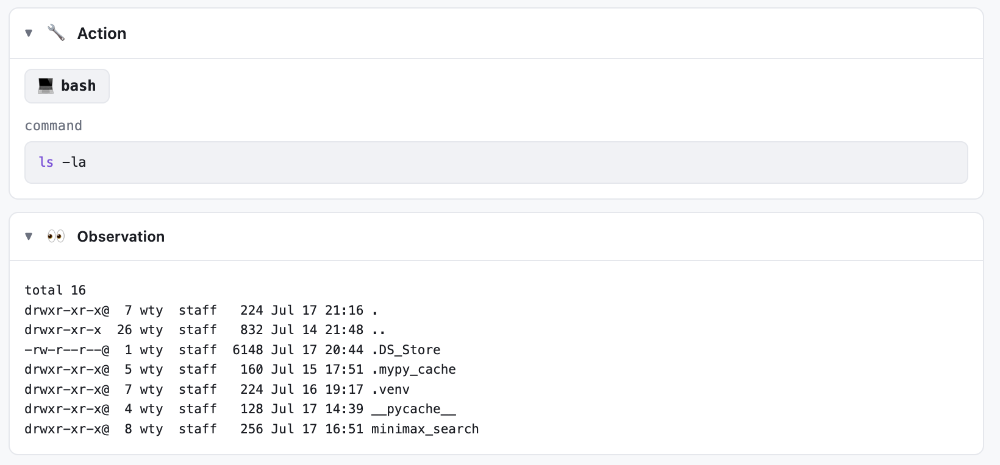
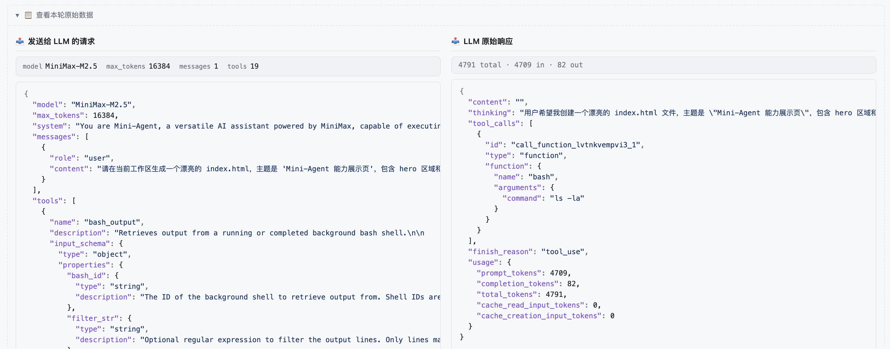
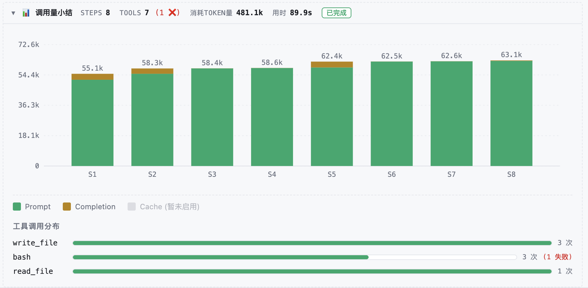
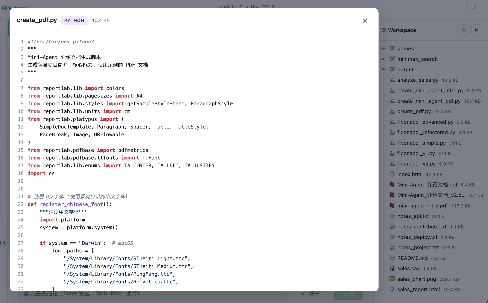
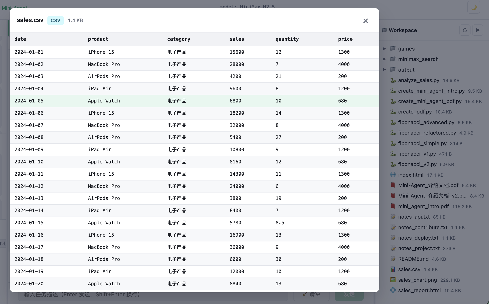
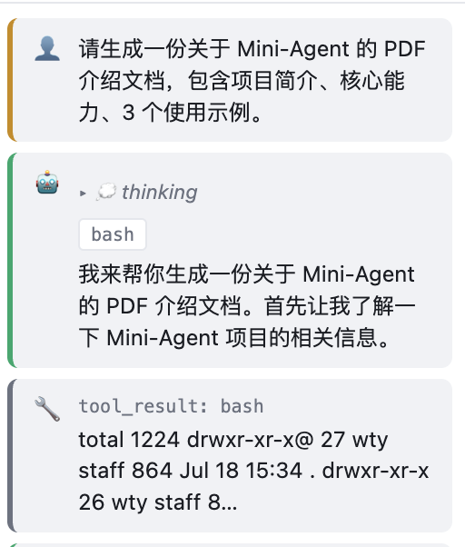
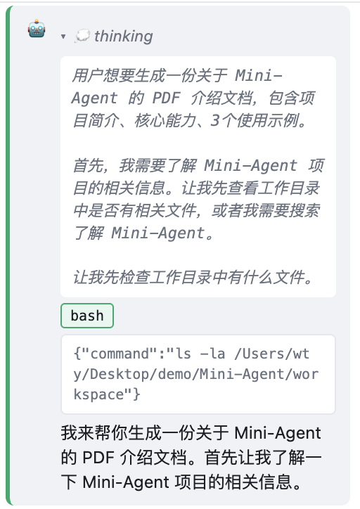

# 🔪 解剖一个 Agent 🧠

> 一个面向 **AI 学习者 / Agent 学习者** 与 **准 AI 产品经理** 的可视化教学项目。
> 基于 [MiniMax-AI/Mini-Agent](https://github.com/MiniMax-AI/Mini-Agent) 构建，
> 把 Agent 的运行机制从"黑盒 CLI"拆解到"看得见的网页"。
> 总代码量 12,000+ 行：36 个源文件，覆盖前后端完整可视化层

## 一、项目背景

### 写给谁看？

- **在学 AI / Agent 的学生** — 想真正理解"Agent 在干什么"，而不是停留在 ChatGPT 对话框；
- **正在转岗 AI 产品经理的从业者**；
- **任何对 Agent 内部运行机制好奇的人** — 但不太习惯命令行交互形式。

### 为什么做这个项目？

[Mini-Agent](https://github.com/MiniMax-AI/Mini-Agent) 是 MiniMax 团队开源的一个**精炼而专业**的 Agent demo 项目，
展示了基于 **MiniMax M2.5** 模型构建 Agent 的最佳实践：通过 **Anthropic 兼容的 API** 接入，
充分利用 **interleaved thinking(交错思考)**，释放 M2 在长链路复杂任务中的推理能力。

它把一个生产级 Agent 该有的能力完整地放在了一个易读的代码库里：

- ✅ **完整的 Agent 执行循环**：自带文件系统 + Shell 工具集；
- ✅ **持久化记忆**：Session Note Tool 让 Agent 在多个会话之间保留关键信息；
- ✅ **智能上下文管理**：对话历史会自动摘要，可配置 token 上限，支持"无限长"任务；
- ✅ **Claude Skills 集成**：内置 **15 个** 专业 Skill，覆盖文档、设计、测试、开发等场景；
- ✅ **MCP 工具集成**：原生支持 MCP，可挂载知识图谱、网页搜索等扩展；
- ✅ **完备的日志**：每一次请求、响应、工具调用都有详细记录，便于调试；
- ✅ **简洁的代码**：漂亮的 CLI + 易读的源码，是构建更高级 Agent 的绝佳起点。

—— 简而言之，这是一个**非常适合学习** Agent 内部机制的项目。
但它的两种官方交互方式都有门槛：

| 交互方式                              | 对学习者不友好的地方                                                         |
| ------------------------------------- | ---------------------------------------------------------------------------- |
| **CLI** (`mini-agent` 命令行) | 思考、工具调用、token 统计全在终端里滚动，一闪而过；对不适应命令行的人不友好 |
| **ACP** (Zed 编辑器集成)        | 需要装 Zed + 配置`settings.json`，对非开发者不友好                         |

所以我做了这个 **WebUI 版本** ——

> 把 Agent 内部"思考 → 行动 → 观察 → 再思考 → 再行动 → ..."的循环，以及 Agent 初始化、作出答复、上下文压缩、记忆落盘的全过程，
> **可视化地、一步一步地** 展示在网页上。
> 你看到的不是一个最终答案，而是**得到这个答案的全过程**。

## 二、网站功能详解

### 2.1 全局布局



打开网站后，默认是**三栏布局**：

- 左侧为短期记忆、长期记忆面板
- 中间为对话区域，从上而下依次为
  - Agent 初始化步骤显示区域
  - 累计上下文长度，可以观察拉满后压缩的过程
  - 对话区域
  - 发命令示例卡片
  - 输入框
- 右侧为工作区展示，所有的操作都会在这个文件夹中进行

项目初启动时会进行 Agent 初始化步骤，5 个步骤逐步点亮，完全同步后端时间节点：

https://github.com/user-attachments/assets/c5046d56-97a9-4d19-b0d7-d2766be95ed7

主题切换 / 布局个性化

- 🌙 / ☀️ **主题切换**：右上角一键切换深色 / 浅色；
- **拖拽分栏**：左侧 Memory、右侧 Workspace、中间 Chat 三栏均可拖拽调节宽度；
- **双击分隔条**：重置为默认宽度；
- **整栏折叠**：每栏可折叠成 32px 的窄条；
- 所有布局偏好都会保存，下次打开自动恢复。

### 2.2 Agent 初始化追踪器

**位置**：聊天面板顶部。

**作用**：把 `Agent.__init__` 这一"黑盒时刻"拆成 **5 步**，一步一步给你看：

| # | 步骤                                                  | 你能看到的                                                          |
| - | ----------------------------------------------------- | ------------------------------------------------------------------- |
| 1 | **Load config**                                 | 实际读取的`config.yaml` 路径 + 内容片段                           |
| 2 | **Build LLM client**                            | LLMClient 构造参数、端点、模型名                                    |
| 3 | **Build tools**                                 | 注册了哪些工具（基础工具 + 工作区工具 + MCP / Skills）              |
| 4 | **Load system prompt + inject skills metadata** | 最终被发给 LLM 的 system prompt 全文                                |
| 5 | **Construct Agent**                             | Agent 的核心参数：`max_steps`、`token_limit`、`workspace_dir` |

**交互**：点击任意一个**已完成**的步骤槽，会展开该步骤的详情，
详情里有 **真实执行过的源码片段**

https://github.com/user-attachments/assets/2e5e8d6b-db72-477c-9bf9-5f4ebcca24d2


### 2.3 能力展示指引板

**位置**：对话区域下方，输入框上方

**作用**：6 张预设的能力卡片，点击就自动把对应 prompt 发送给 Agent，让初学者快速体验 Agent 能做什么。

| 卡片                    | 触发能力                          | 输出样例                                          |
| ----------------------- | --------------------------------- | ------------------------------------------------- |
| 🌐 生成网页             | `WriteTool`                     | 一个漂亮的 HTML 文件，可直接在右侧 workspace 预览 |
| 📊 分析 CSV 数据        | `BashTool` + Python             | 一个带图表的 HTML 可视化报告                      |
| 📄 生成 PDF 文档        | Claude Skill(`document-skills`) | 一份结构化的 PDF 文档                             |
| 🔍 网页搜索与摘要       | MCP 工具（网页搜索）              | 300 字以内中文摘要                                |
| 🛠️ 重构代码           | `WriteTool` + `EditTool`      | 一个重构前 + 一个重构后的 Python 脚本          |
| 📝 写 README / 整理资料 | `WriteTool`                     | 一个结构化的`README.md`                         |

点击后，你可以在**对话区域 / 记忆面板 / 工作区**里看到它留下的所有"痕迹"。

示例1：

https://github.com/user-attachments/assets/c59eb3cb-1600-4617-ac7c-3b659889ca38


示例2（触发skill版）：

https://github.com/user-attachments/assets/fd553e05-b919-40b7-b116-3e6d6c11d1b5


### 2.4 对话面板

**位置**：布局正中，是页面的核心交互区。

#### ReAct 循环结构具象化

> 🧠 **本节最核心的概念 —— Agent 的 Thought → Action → Observation 循环**：
>
> Agent 不是"一次对话给你答案"，而是反复执行下面这个循环，**直到 LLM 自己判断信息够了**：
>
> ```
>        ┌───────────────────────────────────────────┐
>        │                                           │
>        ▼    tool_call                              │
>    Thought ───────────▶ Action ────▶ Observation ──┘
>     (思考)       		(行动)          (观察)
>    推理+决策    			调工具        工具结果回填
>        │  
>        └─ 没有 tool_call ──▶ 终态，Turn 结束
> ```

#### 详细数据逐步披露

本项目的初衷就是彻底剖析 agent 的运行机制，根据上游项目 Mini-Agent 采用的 ReAct 框架，对每一步骤进行披露，将 T→A→O 循环彻底展开。可视化的披露如果还不过瘾，可以直接看原始数据，这些都可以在页面中查看：

- **YOU 块：** 用户输入的指令；
- 
- **Thinking 块**：MiniMax-M2.5 的 interleaved thinking 原文；
- 
- **Action + Observation 块**：每个工具调用一对，展示该步使用的 tool 如 `bash` / `read_file` / `edit_file` / `search` 等、调用该工具时传的参数，以及该步工具的执行结果；
- 
- **Assistant 块**：模型输出给用户的响应，不可折叠，始终显示；
- 
- **原始数据面板**：每步末尾的折叠面板，展开后并列显示 **发给 LLM 的完整 request**(system + messages + tools)和 **收到的原始 response**(content / thinking / tool_calls / usage)；
- 
- **调用量小结**：整轮耗时 + token 柱状图 + 工具调用情况。
- 

#### 上下文窗口管理

该项目中，上下文取自`Agent.messages`，根据 Mini-Agent 项目机制，当上下文超过一个阈值时，会触发`context management`：**用户说过的每句话都原样保留** ，但 agent 在两句话之间干的活（回复、调用工具、工具返回结果）会被**让 LLM 重新读一遍、浓缩成一段摘要**塞回去。这样既能腾出空间，又不丢用户的原始意图。

该位于对话区域上方的进度条：


- 显示当前 LLM 接收的**上下文窗口**长度；
- 进度条颜色会随着数字增加而变化，绿->黄->红；
- LLM 估算上下文长度即将超过阈值时，将暂停任务，先折叠上下文，然后继续任务，压缩后可在`短期记忆/原始数据`清晰看到上下文发生了变化，模型的回复被总结，同 Mini-Agent 项目设计的机制相同。

https://github.com/user-attachments/assets/0d8106c1-6b29-4f64-b793-c119da9626c2


进度条特写：

https://github.com/user-attachments/assets/d7fc0373-b525-4897-b4aa-0f425094ce23


### 2.5 工作区文件树(Workspace Tree)

**位置**：布局最右侧。

**作用**：实时展示 Agent 工作区目录(`<repo>/workspace`)的文件结构。
**每一步执行完毕后自动刷新**，所以你能立刻看到 Agent 新建 / 修改的文件。


- **可点击预览**：点任意文件，在**文件预览弹窗**中打开，针对不同类型的文件做了对应的预览效果；
- **过滤掉噪音**：自动跳过 `.venv`、`__pycache__`、`.agent_memory.json` 等；
- **深度限制**：最多 6 层，避免误入 `node_modules` 黑洞；
- **折叠 / 展开**：整栏可折叠成一条窄边，设置会持久化。




### 2.6 记忆面板(Memory Panel)

**位置**：布局最左侧。

**作用**：把 Agent 的"记忆"这一抽象概念拆成三栏，让你**一眼看清 Agent 在记什么**。

#### 短期记忆(Short-term)

来源：`Agent.messages`(去掉 system prompt)，
在该项目中，和上下文本质相同，即 **LLM 下一次调用时能“看到”的对话历史**。

- 每条消息显示 `角色`(user / assistant / tool，分别为用户输入的指令、大模型输出的文本、工具调用的结果)；
- Assistant 消息会根据实际情况带有 **thinking** 过程或 **tool_calls** 参数；

<table>
<tr>
<td></td>
<td></td>
</tr>
</table>

#### 长期记忆-笔记(Long-term-note)

持久化记忆的一种形式，由 Agent 内置的 `record_note` 工具写入，并通过`recall_notes`读取。由 LLM 根据用户指令自行决定该工具的调用，适合用于记录零碎笔记。落盘到：`workspace/.agent_memory.json`。

该模块展示信息：

- 当前 note 条数，所有 note 的标题、时间、内容；
- 点击"📄"可以打开 **文件预览弹窗**，看完整的 JSON 文件，较为直观地展示长期记忆持久化的形式。

写入长期记忆-笔记：


https://github.com/user-attachments/assets/01e633f4-d9e8-43e5-88eb-8ed35062f04d


读取长期记忆-笔记：

https://github.com/user-attachments/assets/9a6651a3-7916-4836-8039-ab401495428f

#### 长期记忆-图谱(Long-term-graph)

持久化记忆的另一种形式，通过 MCP 接入外部知识图谱能力，具体工具包括：`create_entities`、`create_relations`、`add_observations`、`delete_entities`、`delete_observations`、`delete_relations`、`read_graph`、`search_nodes`、`open_nodes`。由 LLM 根据用户指令自行决定该工具的调用，适合用于记录实体关系，构建图谱知识库。落盘到：`workspace/.mcp_memory.jsonl`。

该模块展示信息：

* 当前实体、关系条数；
* 实体关系示意图，可以放大查看，鼠标悬停可以看到该实体的描述文本；
* 点击"📄"可以打开 **文件预览弹窗**，看完整的 JSONL 文件，较为直观地展示长期记忆持久化的形式。

写入长期记忆-图谱：

https://github.com/user-attachments/assets/6f6006eb-6d99-4370-b60a-c586e59e84d0


读取长期记忆-图谱：

https://github.com/user-attachments/assets/26f5f3a5-6192-4483-b08f-9a83de0830ef

---

## 三、与 Mini-Agent 上游项目的区别

我们保留了上游 Mini-Agent **100% 的核心 Agent 逻辑**(执行循环、工具、记忆、LLM 调用)，
只在**两层**做了扩展：

### 3.1 新增内容（都在 `web/` 下）

**前端不修改任何 Agent 内部代码**，只通过后端的 REST + SSE 接口拿数据 + 推流；
**后端是 Agent 的一个薄包装层**，核心逻辑全部来自 `mini_agent.agent.Agent`。

### 3.2 对上游代码的改动

为了在 WebUI 里**实时看到上下文压缩**，我给上游 `mini_agent/agent.py` 加了一个轻量回调。
**没有改任何核心循环 / 工具 / LLM 行为**：

| 文件 | 改动 | 性质 |
| ---- | ---- | ---- |
| [mini_agent/agent.py](../../mini_agent/agent.py) | • 在 `Agent.__init__` 增加 `on_summary` 可选参数<br>• `_summarize_messages` 增加 `on_summary` 入参，每生成一段 summary 触发一次回调<br>• 在 `run()` 循环结束前补一次 `_summarize_messages(self.on_summary)`，保证最后一步触发的压缩也能被前端看到 | **纯增量**，默认 `None`，上游调用完全不受影响 |
| [pyproject.toml](../../pyproject.toml) | • 新增依赖：`fastapi`、`uvicorn[standard]`、`python-multipart`、`websockets`<br>• `[tool.setuptools.packages.find]` 的 `include` 加入 `"web*"` | 依赖注入 + 打包包含 |
| [uv.lock](../../uv.lock) | 重新生成，锁定新增依赖的版本 | 自动生成 |

> ⚠️ **核心 Agent 逻辑（执行循环 / 工具注册 / LLM 调用 / MCP / Skills）零改动。**
> 上游的 CLI / ACP 入口继续按原方式工作。

---

## 四、快速开始

### 4.1 环境要求

| 依赖                      | 版本 / 说明                                                 | 备注                                  |
| ------------------------- | ----------------------------------------------------------- | ------------------------------------- |
| **Python**          | ≥ 3.10                                                     | 后端 / Agent 运行环境             |
| **Node.js**         | ≥ 20(LTS)                                                 | 仅前端构建 / 开发服务器需要            |
| **uv**              | 最新版                                                     | Python 包管理工具（强烈推荐）    |
| **npm**             | 随 Node.js 自带                                              | 前端依赖安装                          |

**前置要求：安装 uv**

如果你尚未安装 `uv`:

```bash
# macOS / Linux / WSL
curl -LsSf https://astral.sh/uv/install.sh | sh

# Windows (PowerShell)
irm https://astral.sh/uv/install.ps1 | iex
```

### 4.2 获取 API Key

MiniMax 提供国内和海外两个平台，请根据你的网络环境选择：

| 版本       | 平台地址                                                         | API Base                     |
| ---------- | ---------------------------------------------------------------- | ---------------------------- |
| **国内版** | [https://platform.minimaxi.com](https://platform.minimaxi.com) | `https://api.minimaxi.com` |
| **海外版** | [https://platform.minimax.io](https://platform.minimax.io)     | `https://api.minimax.io`   |

获取步骤：

1. 访问相应平台注册并登录
2. 进入 **账户管理 > API 密钥**
3. 点击 **"创建新密钥"**
4. 复制并妥善保存（密钥仅显示一次）

> 💡 请记住你所选平台对应的 API Base 地址，后续配置时会用到。

### 4.3 安装

```bash
# 1. 克隆仓库
git clone https://github.com/NotAvailableeeee/Mini-Agent-Web-UI.git
cd Mini-Agent-Web-UI

# 2. 同步 Python 依赖（会自动装上 web 所需的 fastapi / uvicorn）
uv sync

# 3. 安装前端依赖
cd web/frontend
npm install
```

### 4.4 配置文件 —— `mini_agent/config/` 下两份文件

WebUI 与上游 CLI **共用同一份** `mini_agent/config/` 目录。本节涉及的两份文件，**首次使用都需要先 `cp` example 模板过来再改**：

```bash
# 主配置(必填)
cp mini_agent/config/config-example.yaml mini_agent/config/config.yaml

# MCP 配置(可选 —— 不开 MCP 也可以跳过这一步)
cp mini_agent/config/mcp-example.json   mini_agent/config/mcp.json
```

#### 4.4.1 `config.yaml` —— 主配置(必填)

最小可用配置需要的改动（以中国版为例）：

```yaml
api_key: "YOUR_MINIMAX_API_KEY"
api_base: "https://api.minimaxi.com"
# api_base: "https://api.minimax.io"
```

#### 4.4.2 `mcp.json`(可选 —— 默认未启用)

仓库默认带的是 **`mcp-example.json`**,两个 MCP Server 都处于 `"disabled": true`,
**首次克隆后,Agent 不会自动加载任何 MCP 工具**,网页搜索 / 长期记忆图谱都不可用。

要解锁这些能力，需要在已经 `cp` 出来的 `mcp.json` 里填 Key、再打开 disabled：


需要额外自行获取两个第三方 API Key（都提供免费额度）：

| Key                | 用途                            | 申请地址                                                  |
| ------------------ | ------------------------------- | --------------------------------------------------------- |
| `JINA_API_KEY`   | 网页抓取 / 内容提取             | https://jina.ai/reader/                                   |
| `SERPER_API_KEY` | Google 搜索接口                 | https://serper.dev/                                       |

填好后，把两个 server 的 `"disabled": true` 改成 `"disabled": false`。

> ⚠️ 国内网络环境下的额外配置：
> 如果你在国内使用，建议在 `mcp.json` 里再做下面 3 处修改，能显著降低首次启动的失败率、便于排查问题：

**① 把 `minimax_search` 的源码从远程拉取改成本地路径**

`minimax-search` 是个独立的 MCP server 包，默认从 GitHub 远程拉，国内经常超时。**先 clone 到本地**，再把 `args` 里的 GitHub URL 替换成本地路径：

```bash
# 在你希望放置 MCP 源码的目录（例如 workspace/）下：
git clone https://github.com/MiniMax-AI/minimax_search.git
```

然后修改 `mcp.json` 的 `minimax_search.args`：

```json
"args": [
    "--from",
    "<你的本地路径>/minimax_search",   // ← 替换原来的 git+https://github.com/MiniMax-AI/minimax_search
    "minimax-search"
]
```

**② 给 `minimax_search.env` 加 HuggingFace 镜像 + 本机代理**

在 `minimax_search` 的 `env` 里追加：

```jsonc
"env": {
    "JINA_API_KEY": "...",
    "SERPER_API_KEY": "...",
    "MINIMAX_API_KEY": "...",
    "HF_ENDPOINT": "https://hf-mirror.com",
    "HTTP_PROXY": "http://127.0.0.1:7890",
    "HTTPS_PROXY": "http://127.0.0.1:7890"
}
```

> `HF_ENDPOINT` — `minimax_search` 内部会走 HuggingFace 拉资源，`hf-mirror.com` 是国内可用的镜像，否则大概率超时。

> `HTTP_PROXY` / `HTTPS_PROXY` — 让 MCP 子进程继承本机代理，不然 `browse` 工具会失败。

**③ 给 `memory` 加显式落盘路径，方便查看知识图谱**

默认情况下 `memory` MCP server 会在系统盘随机位置生成 `.mcp_memory.jsonl`,不便观察和备份。建议显式指定到 workspace 下：

```jsonc
"memory": {
    "env": {
        "MEMORY_FILE_PATH": "<你的项目根目录>/workspace/.mcp_memory.jsonl"
    }
}
```

> 改完后，知识图谱的每次写入都会即时落盘到这个文件，你可以在 WebUI 的"长期记忆-图谱"面板里直接看到内容。


### 4.5 启动 WebUI

#### 方式一：一键启动

仓库根目录的 [`web/dev.sh`](dev.sh) 会**同时拉起后端 + 前端**:

```bash
./web/dev.sh # 默认：后端 8000,前端 5173，也支持自定义端口
```

打开浏览器访问 **http://localhost:5173** 即可使用，`Ctrl-C` 会同时清理。

#### 方式二：手动分别启动

```bash
# 终端 ①:后端 (FastAPI)
uv run uvicorn web.backend.app:app --reload --port 8000
# → http://127.0.0.1:8000

# 终端 ②:前端 (Vite)
cd web/frontend
npm run dev
# → http://localhost:5173
```

**⭐ 如果这个项目对你学习 Agent 有帮助，欢迎 Star!**
